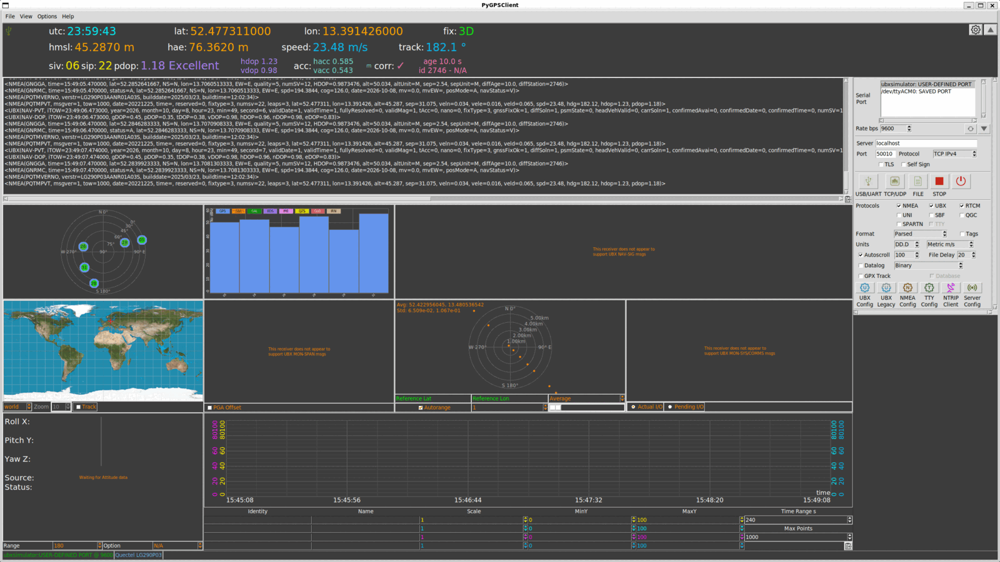

# UBX 模拟器（pyubxutils + pygpsclient）使用指南

本指南从零开始，安装两个 GNSS 工具、准备 `ubxsimulator.json` 配置文件，并用 pygpsclient 独立运行 UBX 串口模拟器。

---

## 快速开始（可运行命令）

按顺序执行即可。

### 第 1 步：安装

```bash
pip3 install pyubxutils pygpsclient
```

### 第 2 步：下载配置文件

```bash
mkdir -p ~/ubxsimulator
curl -o ~/ubxsimulator/ubxsimulator.json \
  https://raw.githubusercontent.com/semuconsulting/pyubxutils/main/examples/ubxsimulator.json
```

### 第 3 步：设置环境变量（必须用绝对路径）

```bash
export UBXSIMULATOR_JSON=/home/luyang/ubxsimulator/ubxsimulator.json
```

> ⚠️ **必须写绝对路径**：`~` 不会被展开。若写 `UBXSIMULATOR_JSON=~/...` 会导致文件找不到。
> 将 `/home/luyang` 换成你的实际主目录。
>
> 想每次开机自动生效，可追加到 `~/.bashrc`：
>
> ```bash
> echo 'export UBXSIMULATOR_JSON=/home/luyang/ubxsimulator/ubxsimulator.json' >> ~/.bashrc
> ```

### 第 4 步：启动 pygpsclient（独立运行，无需再跑 ubxsimulator）

```bash
pygpsclient -U ubxsimulator
```

GUI 中：

1. 串口下拉列表选中 **`ubxsimulator`**
2. 点击 **USB/UART** 图标按钮（不是 TCP/UDP、不是 FILE）
3. Console 面板开始滚动输出定位数据

运行效果截图：



> 💡 pygpsclient 内置了 `ubxsimulator`，会直接读取 `UBXSIMULATOR_JSON` 指向的 json，
> **不需要**另外再运行 `ubxsimulator` 命令。

### （可选）仅用命令行验证模拟器

```bash
ubxsimulator --verbosity 3
```

按 `Ctrl+C` 停止。

---

## 详细说明

### 1. 环境要求

- Linux（本机为 Python 3.14.4）
- `pip3` 已安装
- 建议用户级安装（无需 `sudo`）

### 2. 安装

```bash
pip3 install pyubxutils pygpsclient
```

| 包 | 作用 |
|----|------|
| `pyubxutils` | 提供 UBX 模拟器、配置加载/保存、码率设置等命令行工具 |
| `pygpsclient` | 图形化 GNSS 客户端，接收并可视化模拟器输出 |

安装后命令默认位于 `~/.local/bin/`，需确保它在 `PATH` 中：

```bash
export PATH="$HOME/.local/bin:$PATH"
```

验证：

```bash
ubxsimulator --version
```

### 3. 配置文件

`ubxsimulator.json` 是 pyubxutils 的示例配置，**不会随 pip 安装**，需手动下载。

#### 3.1 默认查找位置（重要）

工具按以下顺序确定配置文件路径：

1. 环境变量 `UBXSIMULATOR_JSON`（若设置）
2. 否则用默认路径 `~/ubxsimulator.json`

> 本指南将配置放在 `~/ubxsimulator/ubxsimulator.json`，**不在默认位置**，
> 因此**必须**设置 `UBXSIMULATOR_JSON` 环境变量，且要用**绝对路径**。
>
> 若不想设环境变量，可直接把文件放到默认位置 `~/ubxsimulator.json`。

#### 3.2 修改 `logfile` 路径

原示例的 `logfile` 是作者 macOS 路径，需改为本机可写的绝对路径：

```json
"logfile": "/home/luyang/ubxsimulator.log",
```

#### 3.3 关键字段

| 字段 | 说明 |
|------|------|
| `interval` | 模拟导航间隔（毫秒），1000 = 1 Hz |
| `timeout` | 模拟串口读超时（秒） |
| `simVector` | 是否启用运动矢量模拟（1 = 启用） |
| `global` | 基准位置（lat/lon/alt）与速度、航向 |
| `ubxmessages` | 要输出的 UBX 报文定义 |
| `nmeamessages` | 要输出的 NMEA 报文定义 |

### 4. 运行方式详解

#### 4.1 方式 A：pygpsclient 内置模拟器（推荐，独立运行）

pygpsclient 内置对 `ubxsimulator` 的支持：串口名指定为特殊值 `ubxsimulator`，
它会自动调用 `pyubxutils.UBXSimulator` 读取 `UBXSIMULATOR_JSON` 指向的配置，
**无需 socat，也无需单独运行 `ubxsimulator` 命令**。

```bash
pygpsclient -U ubxsimulator
```

或环境变量方式（作用相同）：

```bash
PYGPSCLIENT_USERPORT=ubxsimulator pygpsclient
```

#### 4.2 方式 B：socat 虚拟串口对（需要 ubxsimulator 命令）

1. 创建虚拟串口对：

   ```bash
   socat -d -d pty,raw,echo=0 pty,raw,echo=0
   ```

   记下输出的两个设备（如 `/dev/pts/1`、`/dev/pts/2`）。

2. 一端写入模拟数据：

   ```bash
   ubxsimulator | tee /dev/pts/1
   ```

3. 在 pygpsclient 连接另一端 `/dev/pts/2`：

   ```bash
   pygpsclient -U /dev/pts/2
   ```

   ⚠️ `/dev/pts/*` 是伪终端（pty），**不会**出现在 pygpsclient 的串口下拉列表里
   （pyserial 只扫描 `/dev/ttyS*`、`/dev/ttyUSB*`、`/dev/ttyACM*` 等真实串口）。
   需用 `-U`、环境变量 `PYGPSCLIENT_USERPORT`，或在 GUI 的
   “User-defined port” 输入框手动输入。

#### 4.3 命令行运行模拟器

```bash
# 设置 UBXSIMULATOR_JSON 后，可省略 --simconfigfile
ubxsimulator --verbosity 3

# 或显式指定
ubxsimulator \
  --simconfigfile "$UBXSIMULATOR_JSON" \
  --interval 1000 \
  --timeout 3 \
  --verbosity 3
```

按 `Ctrl+C` 停止。

### 5. 验证记录

本机实测（2026-10-08）：

```bash
timeout 5 ubxsimulator --simconfigfile "$UBXSIMULATOR_JSON" --verbosity 3
```

结果：

- ✅ 配置加载成功
- ✅ 输出 `UBX Simulator started`
- ✅ 按 1 Hz 输出 UBX：`NAV-PVT`（定位，位置沿航向 135° 逐秒变化）、`NAV-DOP`、`NAV-SAT`（GPS + Galileo 共 13 颗）
- ✅ 输出 NMEA：`GNGGA`（定位 + 高程）、`GNRMC`（速度 194.38 km/h、航向 126°）、`PQTMVERNO/PQTMPVT`（Quectel 专有）

> 退出码 `124` 是 `timeout 5` 主动终止所致（模拟器本应无限运行），属预期，非错误。

### 6. 常见问题

- **找不到命令**：检查 `~/.local/bin` 是否在 `PATH` 中。
- **配置文件读取失败 / 无数据**：确认 `UBXSIMULATOR_JSON` 已导出且为**绝对路径**，文件确实存在。
- **环境变量用了 `~` 不生效**：`~` 不会被展开，必须写 `/home/用户名/...` 的完整路径。
- **`pygpsclient -U ubxsimulator` 仍无数据**：确认是否已设置 `UBXSIMULATOR_JSON`；否则内置模拟器会去默认位置 `~/ubxsimulator.json` 找配置。

### 7. 已知问题与修复

#### 7.1 pygpsclient 连接后立刻断开（Not connected）

**现象**：点击「USB/UART」连接后，左下角短暂变绿又立刻变回 Not connected，状态栏可能提示 `inactivity timeout`。

**根因**：pyubxutils 的 `ubxsimulator.py` 中 `self._lastread` 被初始化为 `datetime.fromordinal(1)`（公元 1 年）。模拟器 `read()` 的超时判断在**首次读取、缓冲区尚未就绪**时立即成立并抛 `TimeoutError`；pygpsclient 捕获后当作 inactivity timeout 断开。这是启动竞态：消息生产线程约需 1 秒才产出第一批数据。

**修复**：改为 `datetime.now()`。文件：

```text
~/.local/lib/python3.14/site-packages/pyubxutils/ubxsimulator.py
```

```python
# 修改前
self._lastread = datetime.fromordinal(1)
# 修改后
self._lastread = datetime.now()
```

验证：

- ✅ 空缓冲区首次 `read()` 从「立即抛」变为「等待完整 3 秒」
- ✅ 模拟器功能正常

> ⚠️ 直接修改 pip 安装文件，升级 pyubxutils 后会被覆盖，需重新应用。
> 完整分析见 `bugreport/` 目录（含 issue 草稿与 patch）。

### 8. 参考

- pyubxutils 仓库：https://github.com/semuconsulting/pyubxutils
- pygpsclient 仓库：https://github.com/semuconsulting/PyGPSClient
- 示例配置：https://github.com/semuconsulting/pyubxutils/blob/main/examples/ubxsimulator.json
